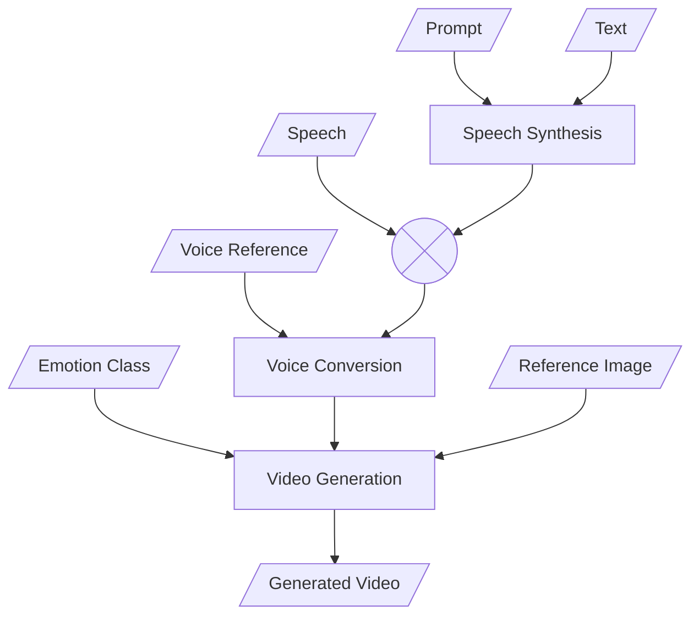

# Loki
## A Video Generation Pipeline

## Contents
1. [Overview](#overview)
2. [Manifest File](#manifest-file)
4. [Running](#running-the-pipeline)
5. [CLI Options]()

## Overview


## Manifest File
When running the pipeline, you must provide a manifest (`.jsonl`) file, where each line is an independent json object.  
Each of the json objects must comply to the one of the following schemas:
|Key|Type|Description|
|---|----|-----------|
|`tts_text`|string|A text to be synthesized|
|`tts_language`|string|Language, supported by the TTS Engine. Currently, one of: Chinese, English, Japanese, Korean, German, French, Russian, Portuguese, Spanish, Italian|
|`tts_target_emotion`|string|One of the keys, defined in [`qwen/tts_emotion_prompts.json`](qwen/tts_emotion_prompts.json): Angry, Disgusted, Fearful, Happy, Neutral, Sad, Surprised|
|`vg_target_emotion`|string|One of defined in [MEMO inference file](https://github.com/Di-Strix/memo/blob/main/memo/inference.py#L166): Angry, Disgusted, Fearful, Happy, Neutral, Sad, Surprised|
|`voice_reference_path`|string|A path to the voice reference `.wav` file|
|`adjust_face_reference_emotion`|string \| bool|Adjusts the reference image's facial expression. Set to a string to specify the emotion, or `true` to inherit `vg_target_emotion`. If unspecified, automatically enabled whenever `vg_target_emotion` is specified. The target emotion must exist in [`qwen/emotion_prompts.json`](qwen/emotion_prompts.json)|
|`face_reference_path`|string|A path to the `.png` image which will be used for video generation|
|`output_path`|string|A path where to save the resulting `.mp4` file to. Must include filename|

|Key|Type|Description|
|---|----|-----------|
|`source_audio_path`|string|A path to the source audio `.wav` file|
|`source_audio_text`|string|[Optional] A transcript of the specified source audio file|
|`tts_target_emotion`|string|See previous table|
|`vg_target_emotion`|string|See previous table|
|`voice_reference_path`|string|See previous table|
|`adjust_face_reference_emotion`|string \| bool|See previous table|
|`face_reference_path`|string|See previous table|
|`output_path`|string|See previous table|

> [!TIP]  
> If path is relative, it is resolved relative to the manifest file.

## Running the pipeline
> [!NOTE]  
> Depending on your hardware, you may want to update pypi indexes in [`pixi.toml`](pixi.toml) and [`memo/memo-pipeline/pixi.toml`](memo/memo-pipeline/pixi.toml)
1. Install [Pixi Package Management Tool](https://pixi.prefix.dev).
2. Clone repo and cd into it
    ```sh
    git clone https://github.com/Di-Strix/Loki
    cd Loki
    ```
3. Prepare [manifest file](#manifest-file)
4. Run the pipeline using your manifest
    ```sh
    pixi run python main.py <manifest-file>
    ```
    Or use reference manifest
    ```sh
    pixi run python main.py manifest.jsonl
    ```

## CLI Options
```
usage: main.py [-h] [--tts-dir TTS_DIR] [--vc-dir VC_DIR] [--device DEVICE] [--overwrite_existing] [--clean [{all,tts,vc}]] manifest

positional arguments:
  manifest              Path to the .jsonl manifest file

options:
  -h, --help             Show this help message and exit
  --tts-dir TTS_DIR      Directory for text-to-speech synthesis results
  --vc-dir VC_DIR        Directory for voice conversion results
  --device DEVICE        Torch accelerator device
  --overwrite_existing   Whether to skip rendering existing output files
  --clean [{all,tts,vc}] Clean directories: 'all', 'tts', or 'vc'. Default is False. If flag is present, the default is 'all'
```